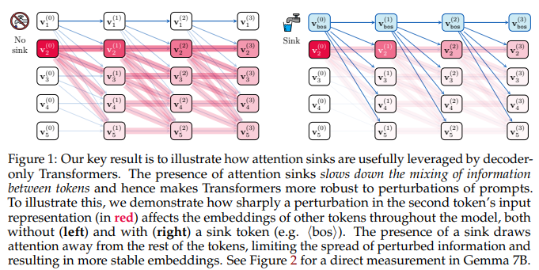
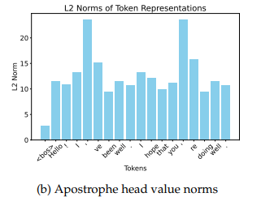
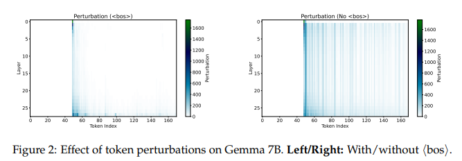
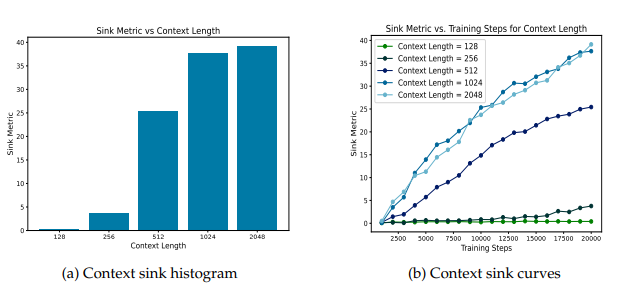
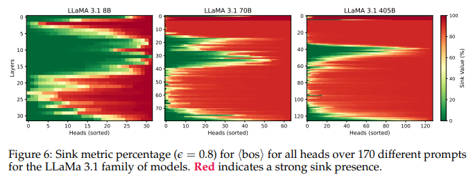

# Why do LLMs attend to the first token?
Federico Barbero, Alvaro Arroyo ,Xiangming Gu,Christos Perivolaropoulos, Michael Bronstein,Petar Veliˇckovic, Razvan Pascanu, COLM 2025

## Summary
Large Language Models (LLMs) consistently show a strange behavior: many of their attention heads focus intensely on the very first token in a sequence . This token is often a **special <bos> (Beginning of Sequence)** token that doesn't carry much semantic meaning. For example, in a powerful model like LLaMa 3.1 405B, a staggering 80% of the attention heads can form strong sinks, directing most of their focus to this single starting token .

At first glance, this looks incredibly inefficient it seems as if the model is "wasting" its computational power . However, this paper argues that this peculiar behavior, called an attention sink, is not a flaw. Instead, it's a crucial way in which the model learns how to **overcome a fundamental problem** in its own architecture.

The core issue addressed by attention sinks is **"over-mixing"** . A Transformer operates on the principle of  repeatedly mixing information between tokens at every layer. While this is necessary principle for understanding context, however it stems into a problem in very deep models or when processing long sequences/A large context.

Intuitively you can think of it like mixing paint 🎨. If you start with a dozen distinct colors and mix them together once, you create different and unique shades. But if you keep mixing them over and over again, all the unique colors eventually blur into a single, muddy, uniform brown.

  

In an LLM, the same thing happens to the token representations. After too many layers of mixing, the unique information for each token can get "smoothed out," and all the tokens start to look the same to the model . This is related to concepts like **rank collapse**(phenomenon where the representations of all the different tokens in a sequence become too similar to each other as they pass through the model's layer) and **over-smoothing**(essentially the same phenomenon as rank collapse, but the term is typically used when discussing Graph Neural Networks (GNNs)). When this information blur happens, the model can no longer distinguish between tokens effectively, which harms its ability to make accurate predictions.

Attention sinks provide a simple but effective solution: they give attention heads an "off-switch" or a "do nothing" option .

Here’s how it works:

1. **The Sink as a Neutral Target:** The model learns that the first token (the <bos> token) is a reliable, ever-present, and neutral target.

2. **Low-Information Value:** The value vector associated with this <bos> token is often learned to have a very small norm, meaning it contains very little information .

3. **Skipping the Update:** When an attention head wants to avoid mixing more information into a token, it simply directs all its attention to the <bos> sink. It picks up the low-information value, and when that is added back to the token's representation, it changes it very little(it's like adding zero ). The token effectively skips the mixing step in that layer, preserving its distinct information.

This allows the model to dynamically control how much mixing happens at each layer for each token, preventing the representations from becoming a blurry mess .

  

## Main Contributions
The paper provides strong experimental evidence to back up this theory.

**The Stability Test:** In Gemma 7B, the researchers made a tiny change to a prompt (changing the word "greatest" to "best") .

With the sink: The change had a limited, controlled impact.

Without the sink: The change caused a much larger and more chaotic ripple effect across all other token representations, showing the model was less stable .

  

**The Context Length Test:** The team trained smaller models from scratch on different context lengths.

* Models trained on short contexts (128 tokens) developed almost no attention sinks .

* Models trained on long contexts (2048 tokens) developed very strong and prevalent sinks . This shows that sinks emerge specifically as a necessary tool to handle long-range information mixing.

  

**The Model Scale Test:** By analyzing LLaMa 3.1, they found a clear trend: the bigger and deeper the model, the more it relies on sinks . This is evident in the 405B model, where sinks are the default behavior for the vast majority of heads .

  

**The Performance Test:** Removing the <bos> token during inference on a trained Gemma 7B model had a severe impact. Performance dropped across many standard benchmarks, and on long-context tasks(Ruler), the model's score fell from 82.57 to 0.00, a complete failure . This proves the model doesn't just use the sink—it becomes dependent on it to function correctly, especially in the long-context scenarios where it's needed most .

## Two-Cents
This paper argues that "attention sinks"—where LLMs focus heavily on the first token—are a crucial learned mechanism to prevent the over-mixing of information and maintain stability in deep networks. This behavior is vital for robustly processing long contexts. However this opens up more potential research directions which could focus on identifying the core causes for attention sinks and how to overcome this, the following are a few papers which prove this trend.
* [Softpick](https://arxiv.org/abs/2504.20966)
* [Only Large Weights (And Not Skip Connections) Can Prevent the Perils of Rank Collapse](https://arxiv.org/abs/2505.16284)
* [Gated Attention](https://arxiv.org/abs/2505.06708)

## References 
[Why do LLMs attend to the first token](https://arxiv.org/abs/2504.02732)